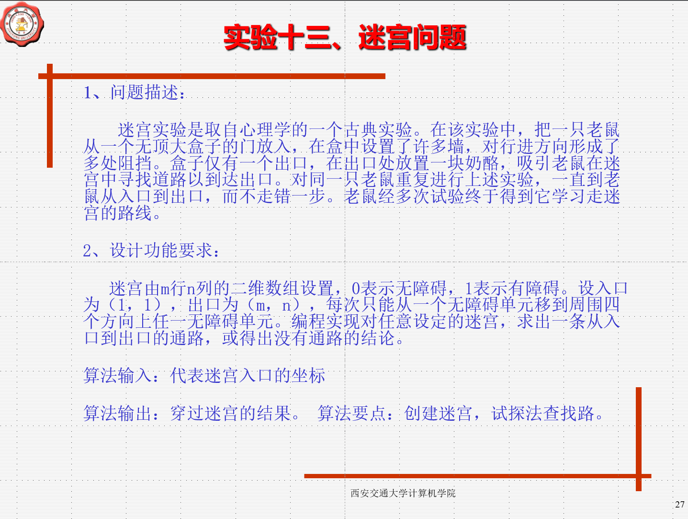

这个题还是比较简单的
>我们只需要对图进行遍历就好了，不过，在这里我们应该要学习的是贪心算法
>我们要感受贪心算法对算法时间提升的效果

``` 
之前使用过java进行编写，我后续可能会把代码找出来，当时学贪心算法的时候
比较激动，因为对于一个20*20的图，当时好像3个小时都解不出来。
也可能是因为我代码逻辑有问题，
不过也不太可能，因为当时用的是递归，栈调用资源很多
```

##### 开发流程
 * 先用0 1 表示图，后续再进行UI展示
 * 1表示通路，0表示墙壁 